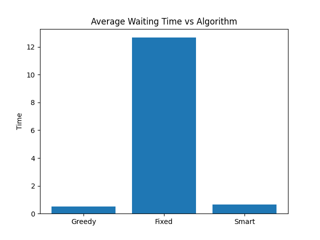
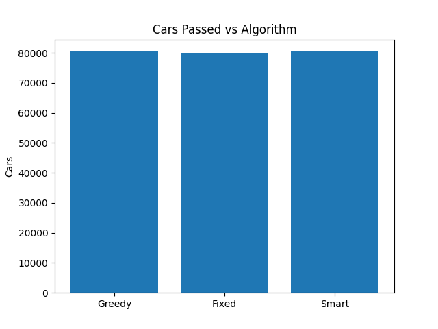

# Traffic Light Optimization

This project simulates a 4-way traffic intersection to compare different algorithms aimed at minimizing vehicle waiting time and maximizing traffic flow.

## Project Structure

```text
traffic-optimization/
│
├── main.py                # Entry point: runs simulations and reports
│
├── simulation/
│   ├── environment.py     # Core logic: queues, car generation, time steps
│   └── car.py             # Car object definitions (optional)
│
├── algorithms/
│   ├── greedy.py          # Prioritizes the longest queue
│   ├── fixed.py           # Uses a time-based rotation (Baseline)
│   └── smart.py           # Adaptive heuristic (Queue length + Wait time)
│
├── utils/
│   ├── metrics.py         # Statistical calculations
│   └── visualization.py   # Pygame animation logic
│
├── data/
│   └── input_config.json  # Simulation parameters (arrival rate, steps)
│
└── README.md
```

## How It Works

1.  **Environment**: The simulation operates in discrete "steps." Each step, cars are randomly generated at four directions (N, S, E, W) based on an arrival probability.
2.  **Algorithms**:
    *   **Fixed**: Rotates the green light every $X$ steps regardless of traffic volume.
    *   **Greedy**: Checks all queues and gives green to the one with the most cars.
    *   **Smart**: Calculates a score based on queue length and how long cars have been waiting. It includes a "Yellow Light" penalty to discourage excessive switching.
3.  **Metrics**: The system tracks `total_wait_time`, `average_wait_time`, and `cars_passed`.

## Installation & Requirements

To run this simulation, you need Python installed along with the following libraries:

*   **Pygame**: For the visual simulation.
*   **Matplotlib**: For generating performance graphs.

Install them using pip:

```bash
pip install pygame matplotlib
```

## How to Run

1.  **Run with Visuals**: To watch a specific algorithm in action, run:
    ```bash
    python main.py
    ```
    Then select the algorithm number from the menu.

2.  **Run Report**: To compare all algorithms instantly without animation:
    Select **Option 4** in the main menu.

## Conclusion & Results

| Algorithm | Performance | Verdict |
| :--- | :--- | :--- |
| **Greedy** | Best Average Wait | Excellent for speed, but can "starve" quiet roads. |
| **Smart** | Best Throughput | Most balanced; cleared the most total cars in long runs. |
| **Fixed** | Worst Overall | Reliable but highly inefficient for random traffic. |

## Lessons Learned & Mistakes

*   **The Yellow Light Trap**: Our initial tests showed Greedy performing slightly better than Smart because the model lacked a transition delay. We realized that because Greedy "switches" lanes instantly to chase the highest queue,
     it artificially inflates its efficiency. In a real-world system, this behavior causes a bottleneck. This taught us that an algorithm must account for the "cost of switching" to be truly effective.
*   **Scale Matters**: Testing for only 50 steps didn't show the full picture. Running for 100,000+ steps revealed that the Smart algorithm cleared more total cars than Greedy, even if Greedy's average wait was slightly lower.
*   **Zero-Footprint Logic**: Separating the visualization from the logic allowed us to run massive data reports much faster than watching the animation.

### Visual Comparisons


*Figure 1: Average Waiting Time comparison across all three algorithms.*



*Figure 2: Total throughput comparison showing the Smart algorithm's lead.*

